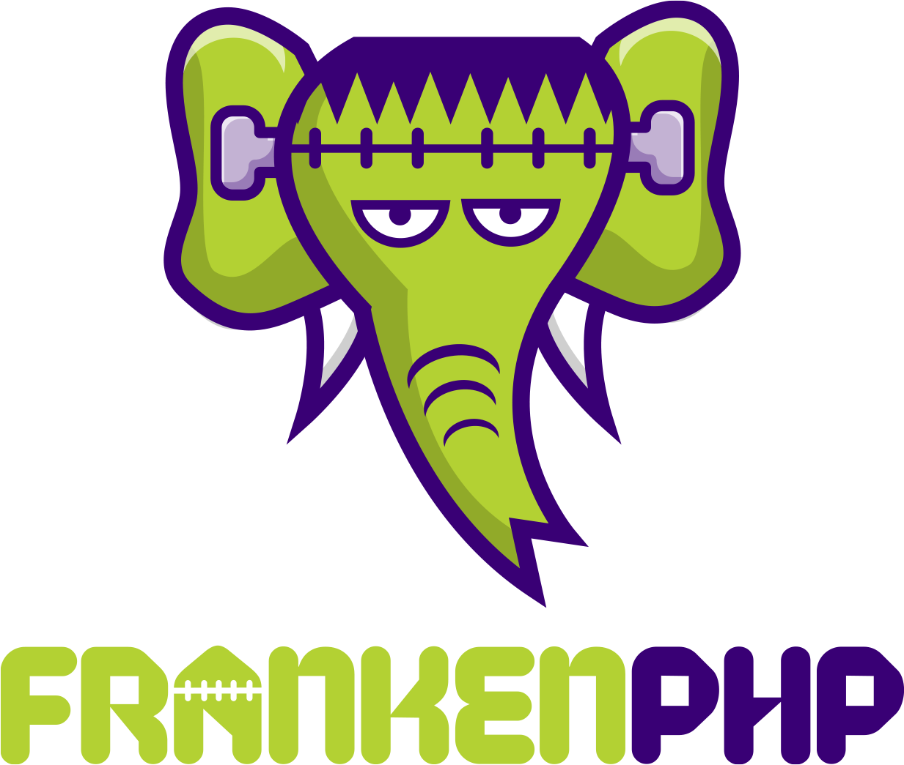

# FrankenPHP: Modern App Server for PHP

<h1 align="center"><a href="https://frankenphp.dev"></a></h1>

FrankenPHP is a modern application server for PHP built on top of the [Caddy](https://caddyserver.com/) web server.

FrankenPHP gives superpowers to your PHP apps thanks to its stunning features: [*Early Hints*](docs/early-hints.md), [worker mode](docs/worker.md), [real-time capabilities](docs/mercure.md), automatic HTTPS, HTTP/2 and HTTP/3 support...

FrankenPHP works with any PHP app and makes your Symfony projects faster than ever thanks to provided integration with the worker mode (Laravel Octane support coming).

FrankenPHP can also be used as a standalone Go library to embed PHP in any app using `net/http`.

[**Learn more** on *frankenphp.dev*](https://frankenphp.dev) in this slide deck:

<a href="https://dunglas.dev/2022/10/frankenphp-the-modern-php-app-server-written-in-go/"></a>

## Getting Started

☢️ FrankenPHP is very experimental, don't use it in production yet, [file bugs](https://github.com/dunglas/frankenphp/issues) and write patches! ☢️

```
docker run -v $PWD:/app/public \
    -p 80:80 -p 443:443 \
    dunglas/frankenphp
```

Go to `https://localhost`, and enjoy!

> Note: do not attempt to use `https://127.0.0.1`. Use `localhost` and accept the self-signed certificate. Caddy has an automatic TLS handling that auto-trusts some local-based hostnames like `localhost`, but it does not apply to IP addresses. More details [on Caddy's "automatic https" docs](https://caddyserver.com/docs/automatic-https#hostname-requirements).

## Docs

* [The worker mode](docs/worker.md)
* [Early Hints support (103 HTTP status code)](docs/early-hints.md)
* [Real-time](docs/mercure.md)
* [Configuration](docs/config.md)
* [Demo app (Symfony) and benchmarks](https://github.com/dunglas/frankenphp-demo)
* [Building Docker images](docs/docker.md)
* [Compile from sources](docs/compile.md)
* [Go library documentation](https://pkg.go.dev/github.com/dunglas/frankenphp)
* [Contributing and debugging](CONTRIBUTING.md)
