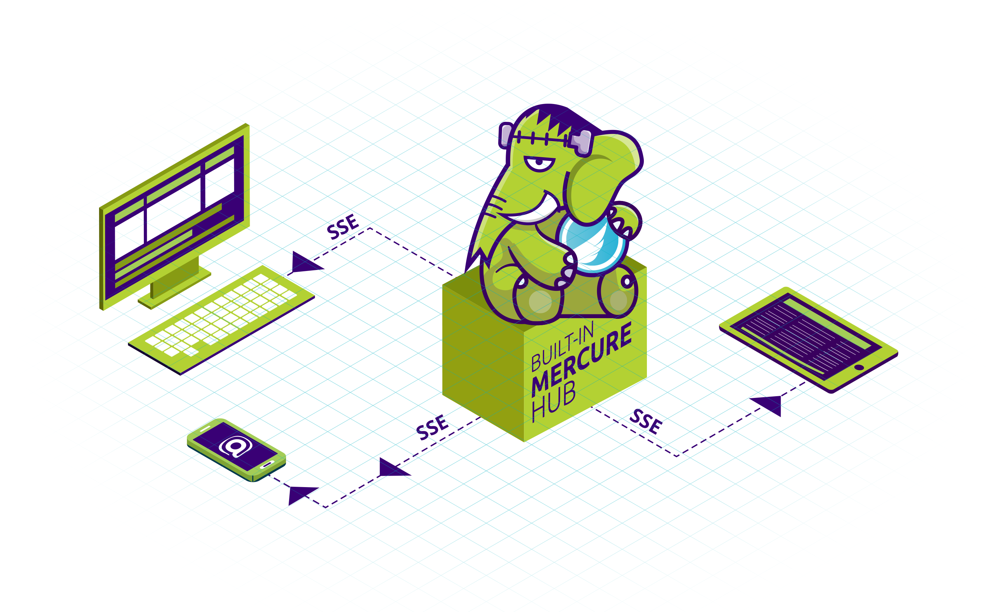

# Temps Réel

FrankenPHP est livré avec un hub [Mercure](https://mercure.rocks) intégré.
Mercure permet de pousser des événements en temps réel vers tous les appareils connectés : ils recevront un événement JavaScript instantanément.

Aucune bibliothèque JS ou SDK requis !

Pour activer le hub Mercure, mettez à jour le `Caddyfile` comme décrit [sur le site de Mercure](https://mercure.rocks/docs/hub/config).

Pour pousser des mises à jour Mercure depuis votre code, nous recommandons le [Composant Mercure de Symfony](https://symfony.com/components/Mercure) (vous n'avez pas besoin du framework full stack Symfony pour l'utiliser).
