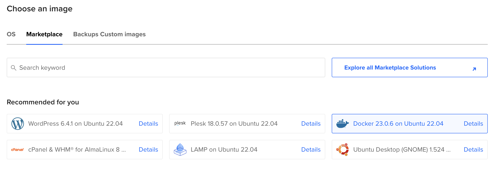

# Déploiement en Production

Dans ce tutoriel, nous apprendrons comment déployer une application PHP sur un serveur unique en utilisant Docker Compose.

Si vous utilisez Symfony, lisez plutôt la page de documentation "[Déployer en production](https://github.com/dunglas/symfony-docker/blob/main/docs/production.md)" du projet Symfony Docker (qui utilise FrankenPHP).

Si vous utilisez API Platform (qui utilise également FrankenPHP), référez-vous à [la documentation de déploiement du framework](https://api-platform.com/docs/deployment/).

## Préparer votre application

Tout d'abord, créez un `Dockerfile` dans le répertoire racine de votre projet PHP :

```dockerfile
FROM dunglas/frankenphp

# Assurez-vous de remplacer "your-domain-name.example.com" par votre nom de domaine
ENV SERVER_NAME=your-domain-name.example.com
# Si vous souhaitez désactiver HTTPS, utilisez cette valeur à la place :
#ENV SERVER_NAME=:80

# Si votre projet n'utilise pas le répertoire "public" comme racine web, vous pouvez le définir ici :
# ENV SERVER_ROOT=web/

# Activer les paramètres de production de PHP
RUN mv "$PHP_INI_DIR/php.ini-production" "$PHP_INI_DIR/php.ini"

# Copiez les fichiers PHP de votre projet dans le répertoire public
COPY . /app/public
# Si vous utilisez Symfony ou Laravel, vous devez copier l'intégralité du projet à la place :
#COPY . /app
```

Consultez "[Construire une image Docker personnalisée](docker.md)" pour plus de détails et d'options,
et pour apprendre à personnaliser la configuration, installer des extensions PHP et des modules Caddy.

Si votre projet utilise Composer, assurez-vous de l'inclure dans l'image Docker et d'installer vos dépendances.

Ensuite, ajoutez un fichier `compose.yaml` :

```yaml
services:
  php:
    image: dunglas/frankenphp
    restart: always
    ports:
      - "80:80" # HTTP
      - "443:443" # HTTPS
      - "443:443/udp" # HTTP/3
    volumes:
      - caddy_data:/data
      - caddy_config:/config

# Volumes nécessaires pour les certificats et la configuration de Caddy
volumes:
  caddy_data:
  caddy_config:
```

> [!NOTE]
>
> Les exemples précédents sont destinés à une utilisation en production.
> En développement, vous pourriez vouloir utiliser un volume, une configuration PHP différente et une valeur différente pour la variable d'environnement `SERVER_NAME`.
>
> Jetez un œil au projet [Symfony Docker](https://github.com/dunglas/symfony-docker)
> (qui utilise FrankenPHP) pour un exemple plus avancé utilisant des images multi-étapes,
> Composer, des extensions PHP supplémentaires, etc.

Pour finir, si vous utilisez Git, commitez ces fichiers et poussez-les.

## Préparer un serveur

Pour déployer votre application en production, vous avez besoin d'un serveur.
Dans ce tutoriel, nous utiliserons une machine virtuelle fournie par DigitalOcean, mais n'importe quel serveur Linux peut fonctionner.
Si vous avez déjà un serveur Linux avec Docker installé, vous pouvez passer directement à [la section suivante](#configurer-un-nom-de-domaine).

Sinon, utilisez [ce lien affilié](https://m.do.co/c/5d8aabe3ab80) pour obtenir 200$ de crédit gratuit, créez un compte, puis cliquez sur "Créer un Droplet".
Ensuite, cliquez sur l'onglet "Marketplace" sous la section "Choisir une image" et recherchez l'application nommée "Docker".
Cela provisionnera un serveur Ubuntu avec les dernières versions de Docker et Docker Compose déjà installées !

Pour des fins de test, les plans les moins chers seront suffisants.
Pour une utilisation en production réelle, vous voudrez probablement choisir un plan dans la section "General Usage" pour répondre à vos besoins.



Vous pouvez conserver les paramètres par défaut pour les autres paramètres, ou les ajuster selon vos besoins.
N'oubliez pas d'ajouter votre clé SSH ou de créer un mot de passe puis appuyez sur le bouton "Finalize and create".

Ensuite, attendez quelques secondes pendant que votre Droplet est en cours de provisionnement.
Lorsque votre Droplet est prêt, utilisez SSH pour vous connecter :

```console
ssh root@<droplet-ip>
```

## Configurer un nom de domaine

Dans la plupart des cas, vous souhaiterez associer un nom de domaine à votre site.
Si vous ne possédez pas encore de nom de domaine, vous devrez en acheter un via un registraire.

Ensuite, créez un enregistrement DNS de type `A` pour votre nom de domaine pointant vers l'adresse IP de votre serveur :

```dns
your-domain-name.example.com.  IN  A     207.154.233.113
```

Exemple avec le service DigitalOcean Domains ("Networking" > "Domains") :


> [!NOTE]
>
> Let's Encrypt, le service utilisé par défaut par FrankenPHP pour générer automatiquement un certificat TLS, ne prend pas en charge l'utilisation d'adresses IP nues. L'utilisation d'un nom de domaine est obligatoire pour utiliser Let's Encrypt.

## Déploiement

Copiez votre projet sur le serveur en utilisant `git clone`, `scp`, ou tout autre outil qui pourrait répondre à votre besoin.
Si vous utilisez GitHub, vous voudrez peut-être utiliser [une clef de déploiement](https://docs.github.com/en/free-pro-team@latest/developers/overview/managing-deploy-keys#deploy-keys).
Les clés de déploiement sont également [prises en charge par GitLab](https://docs.gitlab.com/ee/user/project/deploy_keys/).

Exemple avec Git :

```console
git clone git@github.com:<username>/<project-name>.git
```

Accédez au répertoire contenant votre projet (`<project-name>`), et démarrez l'application en mode production :

```console
docker compose up -d --wait
```

Votre serveur est opérationnel, et un certificat HTTPS a été automatiquement généré pour vous.
Rendez-vous sur `https://your-domain-name.example.com` !

> [!CAUTION]
>
> Docker peut avoir une couche de cache, assurez-vous d'avoir la bonne version de build pour chaque déploiement ou reconstruisez votre projet avec l'option `--no-cache` pour éviter les problèmes de cache.

## Déploiement sur Plusieurs Nœuds

Si vous souhaitez déployer votre application sur un cluster de machines, vous pouvez utiliser [Docker Swarm](https://docs.docker.com/engine/swarm/stack-deploy/), qui est compatible avec les fichiers Compose fournis.
Pour un déploiement sur Kubernetes, jetez un œil au [Helm chart fourni avec API Platform](https://api-platform.com/docs/deployment/kubernetes/), qui utilise FrankenPHP.
