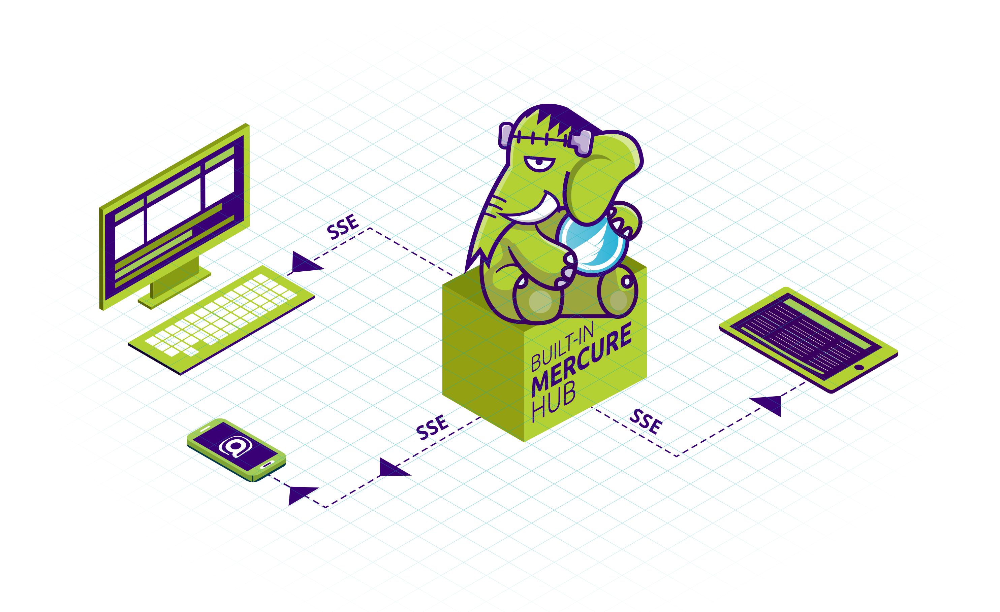

# Real-time

FrankenPHP comes with a built-in [Mercure](https://mercure.rocks) hub!
Mercure allows to push events in real-time to all the connected devices: they will receive a JavaScript event instantly.

No JS library or SDK required!

To enable the Mercure hub, update the `Caddyfile` as described [on Mercure's site](https://mercure.rocks/docs/hub/config).
The URL to send data is `http://php/.well-known/mercure`, the public URL for clients is at the path `/.well-known/mercure`.

To push Mercure updates from your code, we recommend the [Symfony Mercure Component](https://symfony.com/components/Mercure) (you don't need the Symfony full stack framework to use it).
