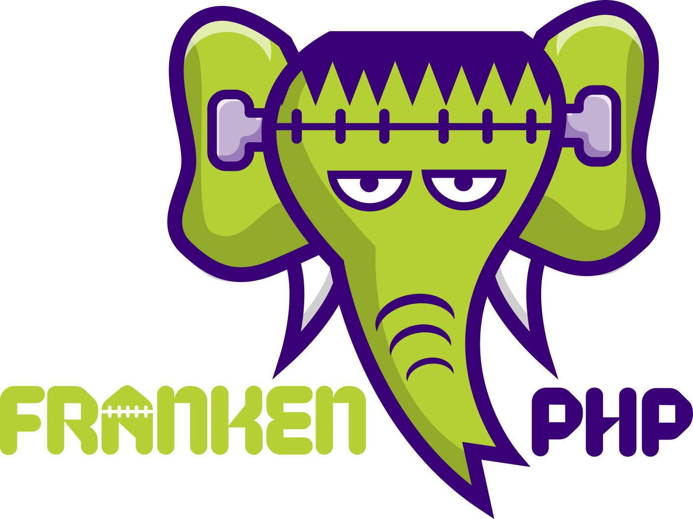

# FrankenPHP: Современный сервер приложений для PHP

<h1 align="center"><a href="https://frankenphp.dev"></a></h1>

**FrankenPHP** — это современный сервер приложений для PHP, построенный на базе веб-сервера [Caddy](https://caddyserver.com/).

FrankenPHP добавляет новые возможности вашим PHP-приложениям благодаря следующим функциям: [_Early Hints_](https://frankenphp.dev/docs/early-hints/), [Worker режим](https://frankenphp.dev/docs/worker/), [Real-time режим](https://frankenphp.dev/docs/mercure/), автоматическая поддержка HTTPS, HTTP/2 и HTTP/3.

FrankenPHP совместим с любыми PHP-приложениями и значительно ускоряет ваши проекты на Laravel и Symfony благодаря их официальной поддержке в worker режиме.

FrankenPHP также может использоваться как автономная Go-библиотека для встраивания PHP в любое приложение с использованием `net/http`.

[**Узнайте больше** на сайте _frankenphp.dev_](https://frankenphp.dev) или из этой презентации:

<a href="https://dunglas.dev/2022/10/frankenphp-the-modern-php-app-server-written-in-go/"></a>

## Начало работы

### Docker

```console
docker run -v .:/app/public \
    -p 80:80 -p 443:443 -p 443:443/udp \
    dunglas/frankenphp
```

Перейдите по адресу `https://localhost` и наслаждайтесь!

> [!TIP]
>
> Не используйте `https://127.0.0.1`. Используйте `https://localhost` и настройте самоподписанный сертификат.  
> Чтобы изменить используемый домен, настройте переменную окружения [`SERVER_NAME`](config.md#переменные-окружения).

### Автономный бинарный файл

Если вы предпочитаете не использовать Docker, мы предоставляем автономный бинарный файл FrankenPHP для Linux и macOS, включающий [PHP 8.4](https://www.php.net/releases/8.4/en.php) и большинство популярных PHP-расширений.

Для Windows используйте [WSL](https://learn.microsoft.com/windows/wsl/) для запуска FrankenPHP.

[Скачать FrankenPHP](https://github.com/php/frankenphp/releases) или выполните следующую команду для автоматической установки подходящей версии:

```console
curl https://frankenphp.dev/install.sh | sh
mv frankenphp /usr/local/bin/
```

Для запуска содержимого текущей директории выполните:

```console
frankenphp php-server
```

Вы также можете запускать CLI-скрипты:

```console
frankenphp php-cli /path/to/your/script.php
```

## Документация

- [Worker режим](https://frankenphp.dev/docs/worker/)
- [Поддержка Early Hints (103 HTTP статус код)](https://frankenphp.dev/docs/early-hints/)
- [Real-time режим](https://frankenphp.dev/docs/mercure/)
- [Конфигурация](https://frankenphp.dev/docs/config/)
- [Docker-образы](https://frankenphp.dev/docs/docker/)
- [Деплой в продакшен](https://frankenphp.dev/docs/production/)
- [Оптимизация производительности](https://frankenphp.dev/docs/performance/)
- [Создание автономного PHP-приложений](https://frankenphp.dev/docs/embed/)
- [Создание статических бинарных файлов](https://frankenphp.dev/docs/static/)
- [Компиляция из исходников](https://frankenphp.dev/docs/compile/)
- [Интеграция с Laravel](https://frankenphp.dev/docs/laravel/)
- [Известные проблемы](https://frankenphp.dev/docs/known-issues/)
- [Демо-приложение (Symfony) и бенчмарки](https://github.com/dunglas/frankenphp-demo)
- [Документация Go-библиотеки](https://pkg.go.dev/github.com/dunglas/frankenphp)
- [Участие в проекте и отладка](https://frankenphp.dev/docs/contributing/)

## Примеры и шаблоны

- [Symfony](https://github.com/dunglas/symfony-docker)
- [API Platform](https://api-platform.com/docs/symfony)
- [Laravel](https://frankenphp.dev/docs/laravel/)
- [Sulu](https://sulu.io/blog/running-sulu-with-frankenphp)
- [WordPress](https://github.com/StephenMiracle/frankenwp)
- [Drupal](https://github.com/dunglas/frankenphp-drupal)
- [Joomla](https://github.com/alexandreelise/frankenphp-joomla)
- [TYPO3](https://github.com/ochorocho/franken-typo3)
