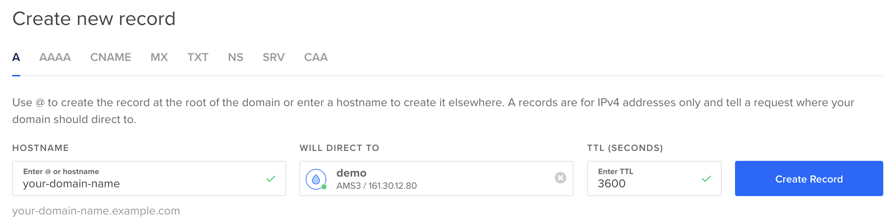

# Деплой в продакшен

В этом руководстве мы рассмотрим, как развернуть PHP-приложение на одном сервере с использованием Docker Compose.

Если вы используете Symfony, рекомендуется прочитать раздел "[Deploy in production](https://github.com/dunglas/symfony-docker/blob/main/docs/production.md)" документации проекта Symfony Docker (в котором используется FrankenPHP).

Если вы используете API Platform (который также работает с FrankenPHP), ознакомьтесь с [документацией по деплою этого фреймворка](https://api-platform.com/docs/deployment/).

## Подготовка приложения

Сначала создайте файл `Dockerfile` в корневой директории вашего PHP-проекта:

```dockerfile
FROM dunglas/frankenphp

# Замените "your-domain-name.example.com" на ваш домен
ENV SERVER_NAME=your-domain-name.example.com
# Если вы хотите отключить HTTPS, используйте вместо этого:
#ENV SERVER_NAME=:80

# Включите настройки PHP для продакшн
RUN mv "$PHP_INI_DIR/php.ini-production" "$PHP_INI_DIR/php.ini"

# Скопируйте файлы PHP вашего проекта в публичную директорию
COPY . /app/public
# Если вы используете Symfony или Laravel, необходимо скопировать весь проект:
#COPY . /app
```

Ознакомьтесь с разделом "[Создание кастомных Docker-образов](docker.md)" для получения дополнительных подробностей и настроек, а также для установки PHP-расширений и модулей Caddy.

Если ваш проект использует Composer, убедитесь, что он включён в Docker-образ, и установите все зависимости.

Затем добавьте файл `compose.yaml`:

```yaml
services:
  php:
    image: dunglas/frankenphp
    restart: always
    ports:
      - "80:80" # HTTP
      - "443:443" # HTTPS
      - "443:443/udp" # HTTP/3
    volumes:
      - caddy_data:/data
      - caddy_config:/config

# Томы, необходимые для сертификатов и конфигурации Caddy
volumes:
  caddy_data:
  caddy_config:
```

> [!NOTE]
>
> Примеры выше предназначены для использования в продакшне.  
> В процессе разработки вы можете использовать том для монтирования, другую конфигурацию PHP и другое значение для переменной окружения `SERVER_NAME`.
>
> Посмотрите проект [Symfony Docker](https://github.com/dunglas/symfony-docker) (который использует FrankenPHP) для более сложного примера с использованием мультистейдж-образов, Composer, дополнительных PHP-расширений и т.д.

Наконец, если вы используете Git, закоммитьте эти файлы и отправьте их в репозиторий.

## Подготовка сервера

Для деплоя приложения в продакшн требуется сервер. В этом руководстве мы будем использовать виртуальную машину, предоставляемую DigitalOcean, но подойдёт любой Linux-сервер.  
Если у вас уже есть Linux-сервер с установленным Docker, вы можете сразу перейти к [следующему разделу](#настройка-доменного-имени).

В противном случае, используйте [эту ссылку](https://m.do.co/c/5d8aabe3ab80), чтобы получить $200 на баланс, создайте аккаунт, затем нажмите "Create a Droplet".  
Перейдите во вкладку "Marketplace" в разделе "Choose an image" и найдите приложение "Docker". Это создаст сервер на Ubuntu с установленными Docker и Docker Compose.

Для тестов подойдут самые дешёвые тарифы. Для реального продакшна выберите тариф из раздела "general purpose" в зависимости от ваших потребностей.


После этого подключитесь к серверу через SSH:

```console
ssh root@<droplet-ip>
```

## Настройка доменного имени

В большинстве случаев вам потребуется связать доменное имя с вашим сайтом.  
Создайте запись DNS типа `A`, указывающую на IP вашего сервера:

```dns
your-domain-name.example.com.  IN  A     207.154.233.113
```

Пример настройки через DigitalOcean ("Networking" > "Domains"):



> [!NOTE]
>
> Let's Encrypt, сервис, используемый FrankenPHP для автоматической генерации TLS-сертификатов, не поддерживает использование IP-адресов. Для работы необходим домен.

## Деплой

Скопируйте ваш проект на сервер с помощью `git clone`, `scp` или любого другого инструмента.  
Если вы используете GitHub, настройте [ключи развёртывания](https://docs.github.com/en/free-pro-team@latest/developers/overview/managing-deploy-keys#deploy-keys).

Пример с использованием Git:

```console
git clone git@github.com:<username>/<project-name>.git
```

Перейдите в директорию проекта и запустите приложение в режиме продакшн:

```console
docker compose up -d --wait
```

Сервер готов, а HTTPS-сертификат был автоматически сгенерирован. Перейдите на `https://your-domain-name.example.com` и наслаждайтесь!

> [!CAUTION]
>
> Docker может кэшировать слои. Убедитесь, что вы используете актуальную сборку, или используйте опцию `--no-cache` для предотвращения проблем с кэшем.

## Деплой на несколько узлов

Если вам нужно развернуть приложение на кластер машин, используйте [Docker Swarm](https://docs.docker.com/engine/swarm/stack-deploy/), который совместим с предоставленными файлами Compose.  
Для деплоя на Kubernetes ознакомьтесь с [Helm-чартом API Platform](https://api-platform.com/docs/deployment/kubernetes/), который использует FrankenPHP.
